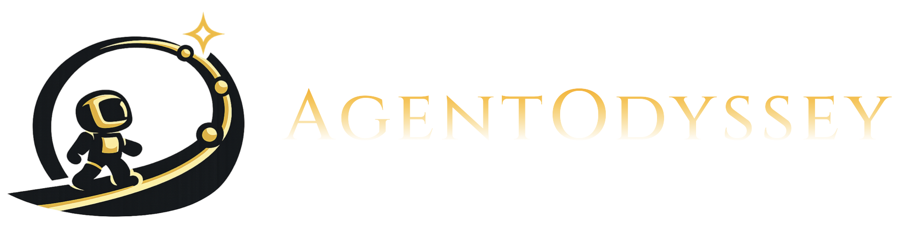

<div align="center">



### **Open-Ended Long-Horizon Text Game Generation Engine and Evaluation Framework <br> for Test-Time Continual Learning Agents**
<br>

<a href="https://agentodyssey.github.io/paper.pdf"></a>&nbsp;
<a href="https://agentodyssey.github.io"></a>&nbsp;
<a href="https://agentodyssey.github.io/docs"></a>&nbsp;
<a href="https://pypi.org/project/agentodyssey/"></a>

</div>

# AgentOdyssey

**AgentOdyssey** is a lightweight interactive environment that supports both novel game generation, a unified agent interface, and multifaceted evaluation. It is designed to evaluate **test-time continual learning agents** across five key abilities: **exploration**, **world knowledge acquisition**, **episodic memory**, **skill learning**, and **long-horizon planning**. Its main features include:
- **Open-Ended Long-Horizon Game Generation**: Generate games with entirely new and rich entities, dynamics, and storylines from a single command.
- **Unified Agent Interface**: All LLM-based agents maximize prompt sharing via inherited classes to ensure fair comparison. Adding a new agent can be done by simplely implementing a few methods.
- **Multifaceted Evaluation Metrics**: Includes a range of metrics beyond game progress to probe specific failure modes of agents.

## Table of Contents

<table style="border-collapse: collapse; border: none;">
<tr style="border: none;">
  <td style="border: none;">🚀 <a href="#quickstart">Quickstart</a></td>
  <td style="border: none;">📦 <a href="#pypi-package">PyPI Package</a></td>
  <td style="border: none;">🎮 <a href="#game-generation">Game Generation</a></td>
  <td style="border: none;">🤖 <a href="#agent-paradigms">Agent Paradigms</a></td>
</tr>
<tr style="border: none;">
  <td style="border: none;">📊 <a href="#evaluation-metrics">Evaluation Metrics</a></td>
  <td style="border: none;">🛠️ <a href="#development">Development</a></td>
  <td style="border: none;">🔧 <a href="#trouble-shooting">Trouble Shooting</a></td>
  <td style="border: none;">📝 <a href="#citation">Citation</a></td>
</tr>
</table>

## Quickstart

**1. Install**

```bash
conda create -n agentodyssey python=3.12 && conda activate agentodyssey
git clone https://github.com/agentodyssey/agentodyssey.git && cd agentodyssey
pip install -e .
```

**2. Set your API key** (if using proprietary LLMs). For example, for OpenAI:

```bash
export OPENAI_API_KEY="your-key"
```

**3. Run an evaluation**

```bash
# Play the game yourself
python eval.py --game_name remnant --agent HumanAgent

# Evaluate an LLM agent (i.e. Long Context Agent)
python eval.py --game_name remnant --agent LongContextAgent --llm_provider openai --llm_name gpt-5
```

> [!NOTE]
> **See the full parameters for evaluation &rarr; [Running Evaluations](http://agentodyssey.github.io/docs/game-apis/full-api-reference)**


## PyPI Package

**1. Install**

```bash
pip install agentodyssey
```

**2. Python API**

AgentOdyssey provides a Python wrapper for seamless integration into your own evaluation pipelines:

```python
from agentodyssey import AgentOdyssey

AgentOdyssey.run(game_name="remnant", agent="LongContextAgent", llm_provider="openai", llm_name="gpt-5")
```

**3. CLI tool**

```bash
# Play the game yourself
agentodyssey run --game-name remnant --agent HumanAgent

# Evaluate an LLM agent
agentodyssey run --game-name remnant --agent LongContextAgent --llm-provider openai --llm-name gpt-5
```

> [!NOTE]
> The CLI uses hyphens (`--game-name`) while `eval.py` and the Python API use underscores (`--game_name`).

## Game Generation

The generation pipeline creates a complete game world through three stages:

1. **Entity generation** populates the world with **locations**, **objects** and **NPCs**.
2. **Rule generation** adds new **world dynamics** including **action rules** that describe player-invoked actions (e.g., pick up, craft, etc) and **step rules** that describe automatic environment dynamics (e.g., day-night cycle).
3. **Quest generation** devises the main storyline that acts as **goals** for the agent to pursue.

```bash
# Generate a themed game and run it
agentodyssey generate "a pirate-themed island adventure" --game-name pirate
agentodyssey run --game-name pirate --agent LongContextAgent --llm-provider openai --llm-name gpt-5
```

Generate with full control over world size, quest structure, and the LLM used for generation:

```bash
agentodyssey generate "a haunted castle with undead enemies" \
    --game-name haunted \
    --num-places 4 \
    --num-objects 20 \
    --num-npcs 10 \
    --num-action-rules 2 \
    --num-step-rules 1 \
    --num-quest-chapters 2 \
    --quest-description "Defeat the Lich King and restore the castle" \
    --llm-provider openai \
    --llm-name gpt-5
```

> [!NOTE]
> **See the full parameters for game generation &rarr; [Generating Games](http://agentodyssey.github.io/docs/game-apis/game-generation)**
>
> **Learn more about the game ontology &rarr; [Game Ontology](http://agentodyssey.github.io/docs/game-ontology/ontology-overview)**

## Agent Paradigms

The environment already implements agents spanning **6 paradigms** as shown below. All LLM-based agents use [ReAct](https://arxiv.org/abs/2210.03629) prompting.

| Paradigm | Agents |
|---|---|
| **Baselines** | `RandomAgent`, `NoMemoryAgent` |
| **Long Context** | `LongContextAgent` |
| **Fixed-Size Memory** | `ShortTermMemoryAgent`, `Mem1Agent` |
| **RAG** | `VanillaRAGAgent`, `Mem0RAGAgent`, `RaptorRAGAgent`, `VoyagerAgent` |
| **SFT** | `LoRASFTAgent`, `FullSFTAgent` |
| **Latent** | `MemoryLLMAgent`, `MPlusAgent` |
| **RL** | *will be released* |

Some agents can be augmented with three optional add-ons: reflection, summarization, and short-term memory (Please refer to the [paper](https://agentodyssey.github.io/paper.pdf) for details.)

> [!NOTE]
> **See detailed descriptions of each paradigm &rarr; [Agent Paradigms](http://agentodyssey.github.io/docs/agent/agent-paradigms)**
>
> **Learn how to implement your own agent &rarr; [Custom Agents](http://agentodyssey.github.io/docs/agent/implementing-agents)**

## Evaluation Metrics

AgentOdyssey evaluates agents along multifaceted axes:

**Game Progress** measures how far the agent advances through in-game objectives. The **main reward** tracks main quest stage completion, while the **supplementary reward** captures exploration, crafting, combat, and side quest progress.

**Model Cost** tracks the total input and output tokens consumed by each agent during a run.

**Diagnostic Testing** probes specific capabilities through targeted tests:

| Metric | What it measures |
|---|---|
| **World Knowledge QA** | Understanding of game facts, rules, and structure (evaluated before and after gameplay) |
| **Episodic Memory QA** | Recall of specific events from the agent's own trajectory |
| **Object Exploration (OE)** | Proportion of available objects the agent has acquired |
| **Action Exploration (AE)** | Proportion of available action types the agent has executed |
| **Action Diversity (AD)** | Entropy-based measure of behavioral diversity over a sliding window |

> [!NOTE]
> **See metric definitions and how to run diagnostic evaluation &rarr; [Evaluation Metrics](http://agentodyssey.github.io/docs/evaluation-metrics)**

## Additional Dependencies

The base `requirements.txt` covers most functionality, but certain agents and providers need extra packages:

| Feature | Extra packages |
|---|---|
| `RaptorRAGAgent` | `tiktoken`, `umap-learn`, `tenacity` |
| `Mem0RAGAgent` | `mem0ai` |
| Gemini (`llm_provider="gemini"`) | `google-genai` |
| Claude (`llm_provider="claude"`) | `anthropic` |

Install only what you need, e.g.:

```bash
pip install tiktoken umap-learn tenacity   # for RaptorRAGAgent
```

## Contributing and Trouble Shooting

For common issues and solutions, please refer to our [Troubleshooting Guide](http://agentodyssey.github.io/docs/troubleshooting). We welcome contributions from everyone and appreciate your help making the project better. For bug reports, feature suggestions, code contributions, and general questions, please refer to our [Contribution Guidelines](CONTRIBUTING.md).

## Citation

✨ If you find AgentOdyssey useful, please cite our work:

```bibtex
@inproceedings{agentodyssey2026,
  title     = {AgentOdyssey: Open-Ended Long-Horizon Text Game Generation for Test-Time Continual Learning Agents},
  author    = {Zhang, Zheyuan and Wen, Zehao and Zhang, Alvin and Wang, Andrew and Xie, Jianwen and Khashabi, Daniel and Shu, Tianmin},
  year      = {2026},
}
```